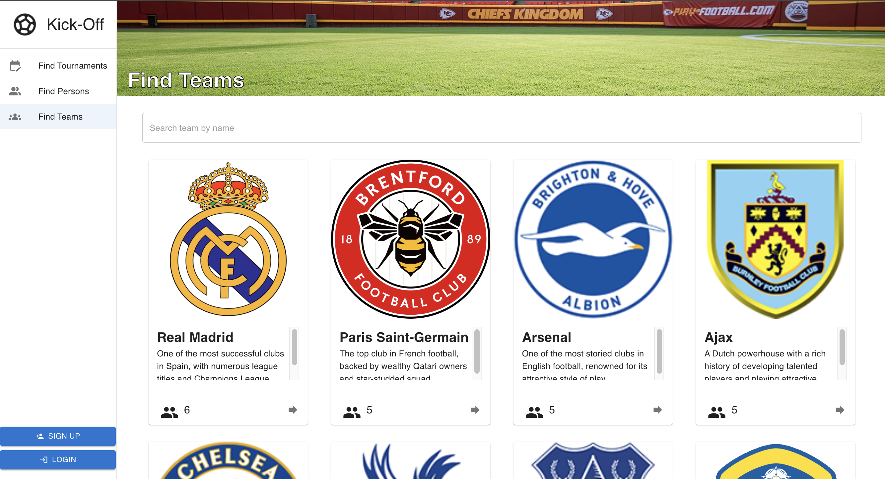

<h1 align="center">
  Kick-off league (client)
  <br>
</h1>

<p align="center">
  <a href="#built-with">Built With</a> •
  <a href="#installation">Installation</a> •
  <a href="#running-the-project">Running the Project</a> •
  <a href="#screenshots">Screenshots</a> •
  <a href="#license">License</a>
</p>

## Built With

- ![JavaScript][JS-badge]
- [![React][React-badge]][React-url]
- [![Vite][Vite-badge]][Vite-url]
- [![MUI][MUI-badge]][MUI-url]

## Installation

1. Clone the repository:

   ```bash
   git clone https://github.com/KritAsawaniramol/kick-off-league_client.git
   ```

2. Navigate to the project directory:

   ```bash
   cd kick-off-league_client
   ```

3. Install the dependencies:

   ```bash
   npm install
   ```

## Running the Project

To start the development server, run:

```bash
npm run dev
```

## Building for Production

To create a production build, run:

```bash
npm run build
```

## Screenshots

### Find Organizer


### Find Person


### Find Team


### Find Tournament


### My Team


### Next Match


### Organizer Information


### Profile


### Profile Statistics


### Requests


### Team Information


### Team Competitions


### Team Members


### Tournament Round Robin


### Tournament Information


## License

This project is licensed under the MIT License. See the [LICENSE](LICENSE) file for details.

[JS-badge]: https://img.shields.io/badge/JavaScript-323330?style=for-the-badge&logo=javascript&logoColor=F7DF1E
[Vite-url]: https://vite.dev/
[Vite-badge]: https://img.shields.io/badge/Vite-B73BFE?style=for-the-badge&logo=vite&logoColor=FFD62E
[React-url]: https://react.dev/
[React-badge]: https://img.shields.io/badge/React-20232A?style=for-the-badge&logo=react&logoColor=61DAFB
[MUI-url]: https://mui.com/
[MUI-badge]: https://img.shields.io/badge/Material%20UI-007FFF?style=for-the-badge&logo=mui&logoColor=white
